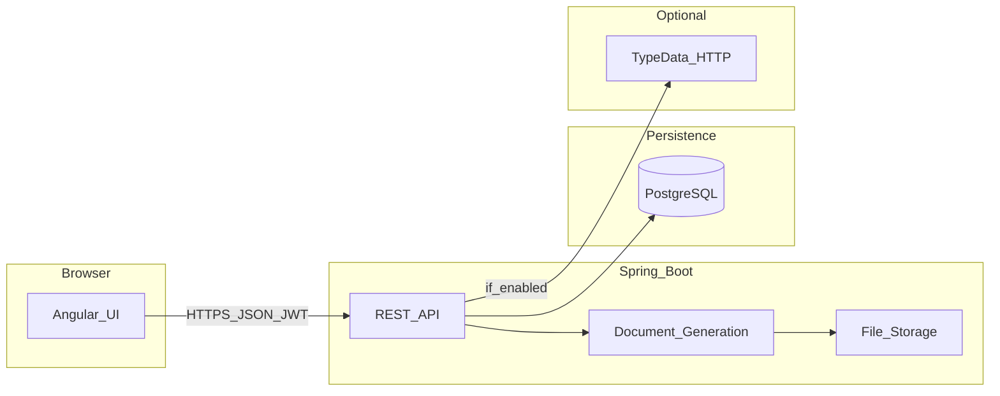

# Информационная система перевозочных документов

Веб-приложение для индивидуальных перевозчиков (ИП и самозанятых) в сфере грузоперевозок: автоматизация комплекта документов (договор-заявка, транспортная накладная, акт выполненных работ), ведение справочников, оформление заказа на перевозку и выгрузка готовых файлов в PDF и DOCX.

Ниже описаны стек, архитектура, требования к окружению, запуск локально и в Docker, устройство backend и frontend, контракты API и параметры Docker Compose.

## Выпускная квалификационная работа

Репозиторий входит в состав выпускной квалификационной работы (**ВКР-ISDL-2026**, ISDL: Information System for Document Logistics) на тему разработки информационной системы формирования перевозочных документов для индивидуальных перевозчиков.

**Цель работы** - повысить эффективность документооборота перевозчика за счёт автоматизации шаблонов нормативно-правовых документов, хранения данных по контрагентам и перевозкам и учёта жизненного цикла заявки.

**Что закрывается программной частью:** модель комплекта документов; клиент-серверное решение на Spring Boot, PostgreSQL и Angular; генерация PDF и DOCX; доступ по JWT с ролями; аудит значимых операций с заказом; автоматические тесты и сборка в Docker Compose.

**Объект и предмет** - документооборот при автомобильной грузоперевозке; методы и средства его автоматизации на базе веб-технологий и единой базы справочников.

К защите помимо кода обычно готовятся пояснительная записка, презентация и выступление; оценка снижения трудозатрат на оформление комплекта документов приводится в записке по согласованной методике. Текст записки, задание, рецензия и прочие материалы вуза в репозиторий не входят.

## Технологический стек

| Компонент | Технологии |
|-----------|------------|
| Сервер | Java 17, Spring Boot, Spring Security, JPA/Hibernate, Flyway |
| Клиент | Angular 19, PrimeNG, Vitest (`ng test`) |
| СУБД | PostgreSQL 16 в Compose; локально совместимо с 14+ |
| Документы | Шаблоны, генерация PDF/DOCX на сервере |
| Инфраструктура | Gradle, npm, Docker Compose |

Опционально: подсказки адресов через TypeData (`TYPEDATA_ENABLED`, `TYPEDATA_TOKEN` в окружении; по умолчанию выключено).

## Архитектура

1. **Веб-клиент (Angular)** - вход и регистрация, справочники (заказчики, исполнители, водители, ТС, адреса), список и карточка заказа (в UI раздел "Рейсы"), скачивание документов после завершения заказа; для `ADMIN` - пользователи.
2. **Сервер (Spring Boot)** - REST `/api/v1`, JWT, заказы и справочники, аудит, генерация документов, запись файлов на диск или в том в Docker.
3. **PostgreSQL** - пользователи, роли, справочники, заказы (`orders`), документы, аудит; схема через Flyway.
4. **Файловое хранилище** - сгенерированные файлы на диске (не основной BLOB в БД).
5. **TypeData (опционально)** - внешний HTTP API подсказок адресов, кэш Caffeine.

В режиме разработки браузер идёт на dev-сервер Angular, запросы `/api` и `/v3` проксируются на Spring ([`frontend/logistic/proxy.conf.js`](frontend/logistic/proxy.conf.js)). В Docker: nginx со статикой проксирует `/api/` и `/v3/` на сервис `backend` ([`frontend/logistic/nginx.conf`](frontend/logistic/nginx.conf)).

**Роли:** `USER` (регистрация создаёт пользователя с этой ролью) и `ADMIN` (учётная запись после инициализации: `admin` / `admin123` только для разработки).



## Требования

- JDK 17+, Node.js 20+, Docker (интеграционные тесты backend, Compose).

## Быстрый старт

### Вариант A: код на машине, БД локально или в Docker

1. PostgreSQL с базой `logistic`, пользователь и пароль `logistic`, порт `5432` (как в [`backend/src/main/resources/application.properties`](backend/src/main/resources/application.properties)).
2. Backend:

```powershell
cd backend
.\gradlew.bat bootRun
```

3. Клиент (в другом терминале):

```powershell
cd frontend\logistic
npm ci
npm start
```

Откройте URL из вывода CLI (часто `http://localhost:4200`). Если API в Docker на порту **7272**, выполните `npm run start:docker-api` или задайте `LOGISTIC_API_PROXY_TARGET`.

### Вариант B: полный стек в Docker Compose

Из корня репозитория:

```powershell
docker compose build
docker compose up
```

- UI: `http://localhost:4200` (nginx + статика Angular)
- API с хоста: `http://localhost:7272`
- PostgreSQL с хоста: `localhost:7727` (внутри сети Compose сервис `db` на порту 5432)

Backend стартует после `healthcheck` базы. Сборка backend в Docker использует образ Gradle; нужны доступы к Docker Hub и Maven Central.

## Backend (Spring Boot)

Каталог: [`backend/`](backend/).

**Конфигурация по умолчанию:** JDBC `jdbc:postgresql://localhost:5432/logistic`, `logistic`/`logistic`; файлы документов: `%USERPROFILE%\.logistic-storage` (свойство `logistic.storage.root`); JWT в `application.properties`; Flyway `classpath:db/migration`.

**Запуск:** порт HTTP **8080**; API `/api/v1/...`; OpenAPI JSON `/v3/api-docs`; Swagger UI путь из `springdoc.swagger-ui.path` (по умолчанию `/swagger-ui.html`).

```powershell
cd backend
.\gradlew.bat test
.\gradlew.bat bootJar
```

Тесты с Testcontainers требуют Docker. Профиль `test` отключает часть интеграций; для инициализации `admin` используйте не тестовый профиль при локальном `bootRun`.

## Frontend (Angular)

Каталог: [`frontend/logistic/`](frontend/logistic/).

В разработке `environment.apiBase` пустой: запросы на тот же origin, прокси на backend по умолчанию `http://localhost:8080` ([`proxy.conf.js`](frontend/logistic/proxy.conf.js)).

```powershell
cd frontend\logistic
npm ci
npm start
npm run start:docker-api
npm run start:mock
npm test
npm run test:coverage
npm run build
```

Сборка: `frontend/logistic/dist/logistic`. Production: `environment.production.ts`, часто `apiBase: ''` при одном хосте с API.

**Маршруты:** `/orders`, `/orders/new`, `/orders/:id`, `/orders/:orderId/edit`, справочники под `/catalogs/...`, `/account`, для `ADMIN` - `/admin/users`. В интерфейсе заказы названы "Рейсы"; REST-ресурс заказов - `orders`, не `trips`.

## Docker Compose (подробно)

| Сервис | Назначение | Порт на хосте |
|--------|------------|----------------|
| `db` | PostgreSQL 16 | 7727 -> 5432 |
| `backend` | Spring Boot | 7272 -> 8080 |
| `frontend` | nginx + Angular, прокси на `backend` | 4200 -> 80 |

Переменные backend в Compose: `SPRING_DATASOURCE_*`, `LOGISTIC_STORAGE_ROOT` (том `docs`), `JWT_SECRET` (замените вне учебного стенда), `TYPEDATA_TOKEN`, `TYPEDATA_ENABLED`.

Тома: `pgdata` (данные БД), `docs` (файлы документов).

## API и ручное тестирование

- Префикс: `/api/v1`; JWT: `Authorization: Bearer <token>`.
- Коллекция: [`api/logistic-api.http`](api/logistic-api.http) (IDE HTTP Client / REST Client).
- Спецификация: [`api/openapi.yaml`](api/openapi.yaml).
- Runtime OpenAPI: `http://localhost:8080/v3/api-docs` (локальный backend) или `http://localhost:7272/v3/api-docs` (API из Compose).
- Swagger UI: тот же хост и порт, путь из `springdoc.swagger-ui.path`.

Группы: аутентификация и регистрация; справочники (`customers`, `performers`, `drivers`, `vehicles`); заказы `orders`; аудит `GET /api/v1/orders/{orderId}/audit-events`; администрирование `/api/v1/admin/users` (роль `ADMIN`). Коллекция ориентирована на `admin` / `admin123`.
